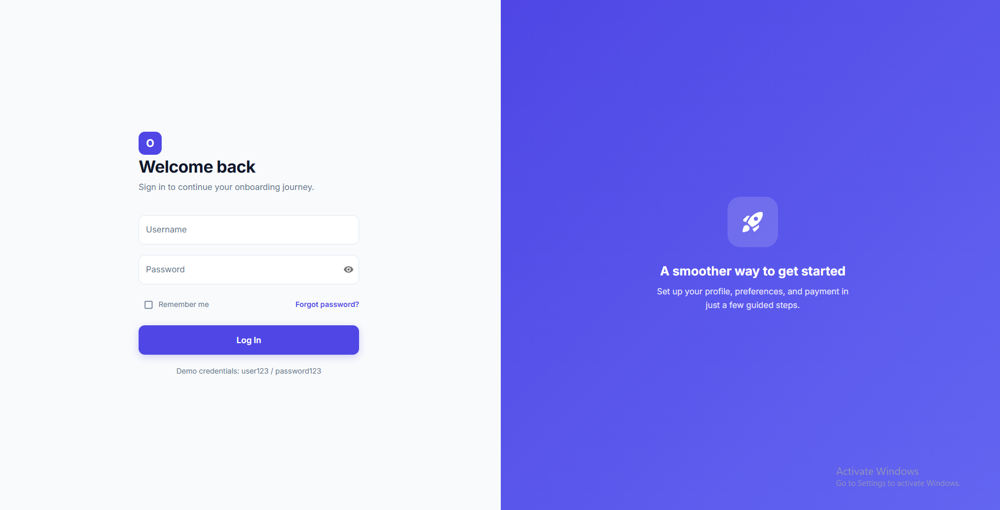
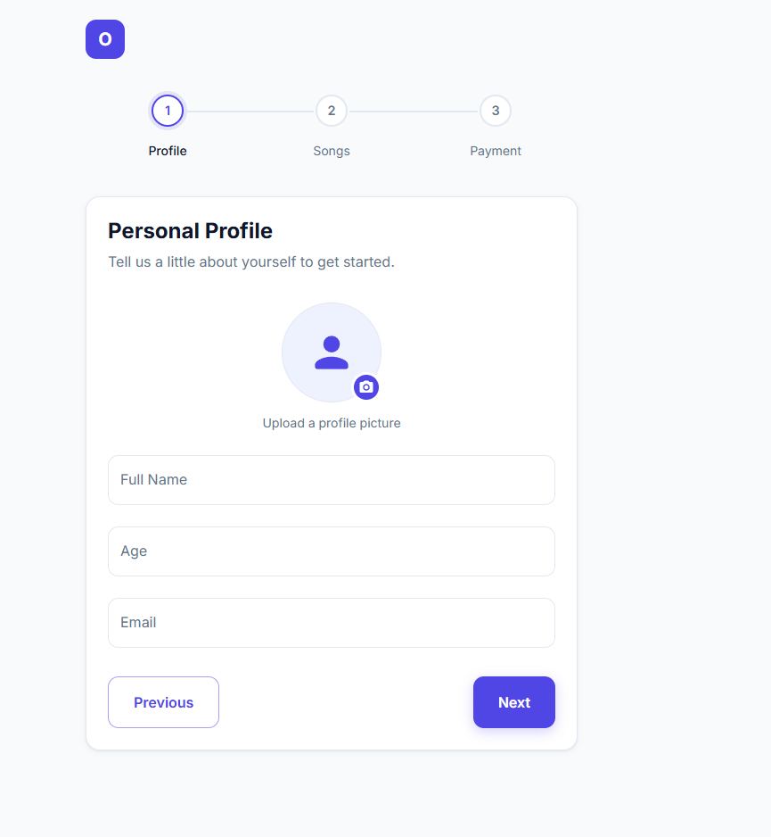
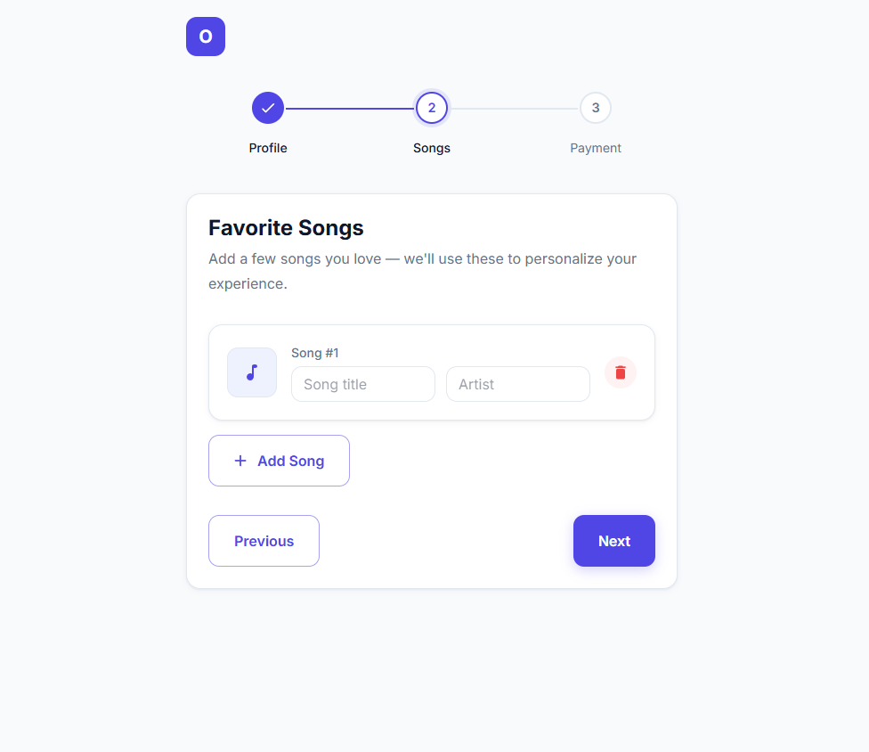
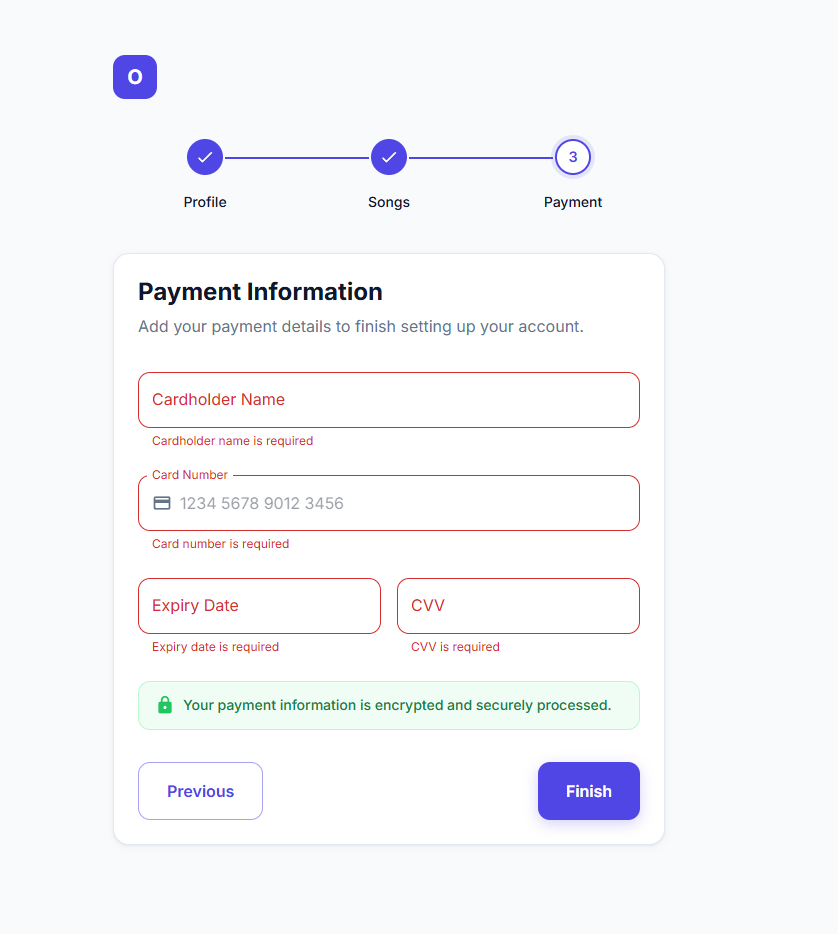
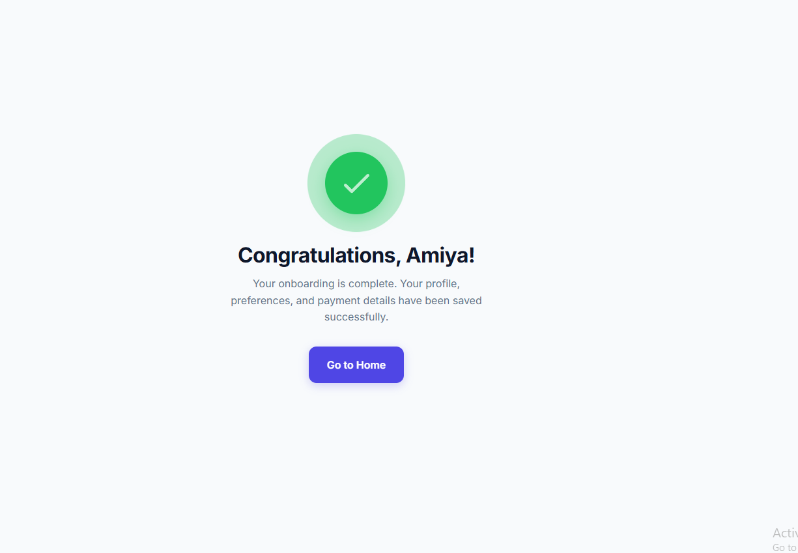
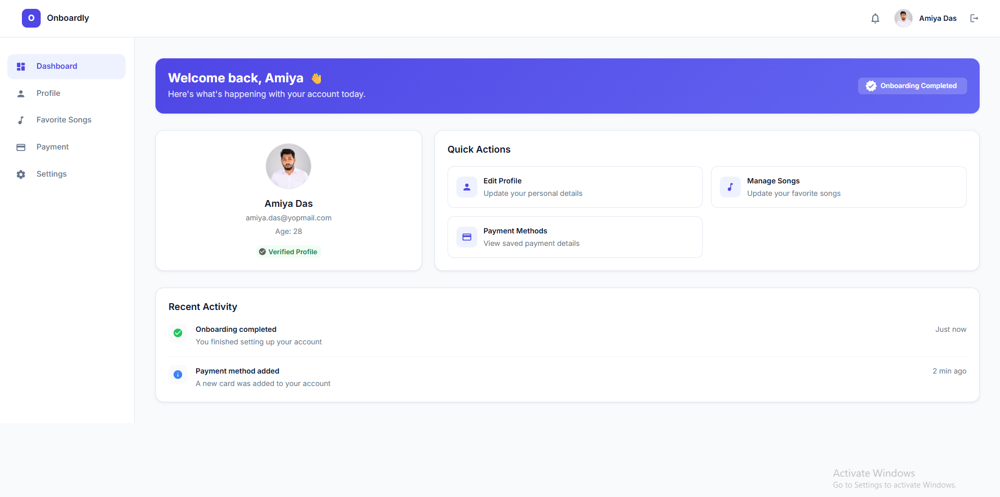

# Onboardly — React Onboarding Flow

A multi-step user onboarding flow built with **React 19**, **TypeScript**, **Redux Toolkit**, **Material UI v7**, and **Formik** — entirely front-end, no backend required.

**🔗 Live demo:** [https://react-onboarding-flow.vercel.app/](https://react-onboarding-flow.vercel.app/)
**Demo credentials:** `user123` / `password123`

---

## Table of Contents

- [Assignment Brief](#assignment-brief)
- [Screenshots](#screenshots)
- [Tech Stack & Why](#tech-stack--why)
- [Key Features](#key-features)
- [Implementation Flow](#implementation-flow)
- [State Management & Persistence](#state-management--persistence)
- [Challenges & How They Were Solved](#challenges--how-they-were-solved)
- [Project Structure](#project-structure)
- [Getting Started](#getting-started)

---

## Assignment Brief

This project implements the following assignment:

> Build an Onboarding Component using React, TypeScript, and Redux. This component is part of a multi-step form for user onboarding.
>
> **Flow:**
> 1. **Login Page** — username/password fields (no API calls). A fixed demo credential pair (`user123` / `password123`) is used for validation. On success, redirect into the onboarding flow.
> 2. **Step 1 — Personal Profile** — capture name, age, email, and profile picture.
> 3. **Step 2 — Favorite Songs** — a dynamically extendable list of songs, built with **Formik**.
> 4. **Step 3 — Payment Information** — card number, expiry date, CVV.
> 5. **Step 4 — Success** — confirmation that onboarding is complete.
> 6. **Home Page** — a welcome dashboard shown once onboarding is done.
>
> **Requirements:**
> - **State management** via Redux for every onboarding step.
> - **Persistence** via `localStorage`: closing the browser mid-onboarding and returning later resumes at the same step; if onboarding is already complete, the user is sent straight to Home.
> - **Navigation** forward and backward between steps without losing previously entered data.
> - **No API calls** — everything, including login validation, runs entirely on the front end.

Everything above is implemented. A few extra screens (Update Profile, Payment Methods, Logout, "coming soon" placeholders) were added afterward as follow-up feature requests — see [Key Features](#key-features).

---

## Screenshots

| Login | Step 1 — Personal Profile |
|---|---|
|  |  |

| Step 2 — Favorite Songs | Step 3 — Payment Information |
|---|---|
|  |  |

| Success | Home Dashboard |
|---|---|
|  |  |

The Step 3 screenshot shows the built-in validation in action — every field is checked (required, format, and a real Luhn checksum on the card number) before the user can finish.

---

## Tech Stack & Why

| Technology | Why it was chosen |
|---|---|
| **React 19 + Vite** | Fast dev server/HMR, minimal config, modern React (no legacy class-component baggage). |
| **TypeScript** | Every prop, Redux action, and form value is typed — catches mismatches (e.g. a field name typo between a form and its Redux action) at compile time instead of at runtime. |
| **Redux Toolkit** | The assignment requires centralized state across a five-screen flow with back/forward navigation. RTK's `createSlice` removes Redux's usual boilerplate (no hand-written action types/creators) while keeping the store fully typed via `RootState`/`AppDispatch`. |
| **Material UI v7** | A complete, accessible component library (inputs, stepper, snackbars, dialogs) with a themeable design system, so the UI could be built to a real visual spec (soft shadows, 16px radii, custom palette) without hand-rolling primitives. |
| **Formik + Yup** | Used where the assignment explicitly calls for it — the dynamic "Favorite Songs" list (`FieldArray` for add/remove) and the Login form. Yup provides declarative schema validation instead of imperative if/else chains. |
| **React Router DOM** | Client-side routing between Login → Step 1–3 → Success → Home, plus guarded routes that redirect based on auth/completion state. |
| **localStorage (no library)** | A thin custom persistence layer (`store/persistence.ts`) subscribes to the Redux store and writes state on every change, with an explicit allow-list of what's safe to persist (see [security](#challenges--how-they-were-solved) below). No third-party persistence library was needed for this scope. |

---

## Key Features

- ✅ Login gated by a fixed demo credential pair, with real validation (not just a "click through") and an inline error on mismatch.
- ✅ 3-step onboarding wizard with a shared `ProgressStepper`, back/forward navigation, and per-step validation that blocks advancing on invalid data.
- ✅ Profile picture upload, stored as a persistable base64 data URL.
- ✅ Dynamic favorite-songs list (Formik `FieldArray`) — add/remove rows, per-row validation.
- ✅ Payment form with production-grade client-side card validation (Luhn checksum, brand-aware length/CVV rules, expiry-not-in-the-past).
- ✅ Redux-backed state for the entire flow, persisted to `localStorage`:
  - Fresh login → Step 1.
  - Closing the browser mid-flow and reopening → resumes at the exact step left off.
  - Onboarding already completed → redirected straight to Home, login screen skipped entirely.
- ✅ Home dashboard: welcome banner, profile summary, "Onboarding Completed" badge, quick actions, recent activity feed.
- ✅ **Update Profile** screen — edit name/age/email/photo after onboarding.
- ✅ **Payment Methods** screen — displays the saved card (brand, last 4 digits, cardholder, expiry) as a styled card visual.
- ✅ **Logout** — clears the session (keeps onboarding progress) and returns to Login.
- ✅ "Coming soon" placeholder screens for features outside the assignment scope (Manage Songs, Settings), so no sidebar/quick-action link is ever a dead click.

---

## Implementation Flow

```
Login  ──(valid credentials)──▶  Step 1: Personal Profile
                                        │  (Next — validated)
                                        ▼
                                 Step 2: Favorite Songs (Formik)
                                        │  (Next — validated)
                                        ▼
                                 Step 3: Payment Information
                                        │  (Finish — validated)
                                        ▼
                                    Success
                                        │  (Go to Home)
                                        ▼
                                  Home Dashboard ──▶ Update Profile / Payment Methods / Coming Soon
```

Every arrow above is a Redux dispatch + route change, handled by a thin "Route" wrapper component per screen (e.g. `Step1Route`, `Step3Route` in `src/App.tsx`). This keeps the actual page components (`Step1`, `Step3`, …) purely presentational — they receive data and callbacks as props and don't know Redux exists, which is also what makes them independently reusable/testable.

**Route guards** (`RequireAuth`, `RequireCompleted`) sit in front of the onboarding and Home routes:

- Not logged in → any onboarding/Home URL redirects to `/`.
- Logged in but onboarding incomplete → `/home` (and the post-onboarding screens) redirect back to the in-progress step.
- The **Login route itself** checks `isAuthenticated`/`isCompleted` on every render and redirects immediately — so a returning, already-onboarded user never even sees the login form again.

---

## State Management & Persistence

Two Redux slices, combined in `src/store/store.ts`:

- **`authSlice`** — `isAuthenticated`, `username`.
- **`onboardingSlice`** — `currentStep`, `isCompleted`, `profile`, `songs`, `payment` (live form values), and `savedPaymentMethod` (the safe, persisted summary of the card — see below).

`src/store/persistence.ts` hydrates the store from `localStorage` on load and writes back on every state change via `store.subscribe()`.

**Security-conscious persistence** — not everything in Redux gets written to disk verbatim:

- The **full card number and CVV are never persisted**, even though they briefly live in Redux while the user is typing them on Step 3. Before finishing, a `savePaymentMethod` action derives only a *safe summary* — card brand (via a BIN-prefix check) and the **last 4 digits** — and that's what's stored and later shown on the Payment Methods screen. CVV is never stored or displayed anywhere, at any point, past initial entry — that's a hard rule for card data, not a style choice.
- Profile pictures are converted to base64 **data URLs** (not blob URLs) precisely so they *can* be persisted — see the next section for why this mattered.

---

## Challenges & How They Were Solved

**1. Blob URLs don't survive a reload.**
The profile picture upload initially used `URL.createObjectURL(file)`. That produces a `blob:` URL scoped to the current page's memory — it silently breaks (broken image icon) after any reload, and can't be meaningfully persisted to `localStorage` even if you save the string. Fixed by switching to `FileReader.readAsDataURL()`, which yields a plain `data:image/png;base64,...` string — a real, serializable value that survives both a Redux round-trip and a browser restart.

**2. "Validate the card number" needed to mean more than a regex.**
A first pass just checked "16 digits." For anything resembling production behavior, card numbers need the **Luhn (mod-10) checksum** — the same algorithm every real card network uses to catch a single mistyped or transposed digit — plus **brand-aware rules**, since Amex is 15 digits with a 4-digit CVV while Visa/Mastercard are 16 digits with a 3-digit CVV. Solved with a small `cardValidators.ts` utility (`detectCardBrand`, `passesLuhnCheck`, brand-aware length/CVV lookups) that the Step 3 validation schema recomputes live as the user types, so the CVV rule adjusts automatically once a brand is recognized. (Note: Luhn + brand detection only catches obviously-wrong numbers — it doesn't verify a card is real or funded. Real production payment handling needs a PCI-compliant processor like Stripe, which requires a backend and was explicitly out of scope here.)

**3. A returning user kept getting bounced back to Step 1 instead of resuming.**
The login handler was dispatching `setCurrentStep(0)` and force-navigating to `/onboarding/step-1` on *every* successful login — which reset an in-progress user's saved step and skipped the "already completed → Home" redirect entirely. The fix was to have `onLogin` do *only* one thing — authenticate — and let the route's own guard clause (which already reads `isCompleted`/`currentStep` from the persisted store) decide the destination. That guard re-runs automatically the instant `isAuthenticated` flips true, so it always redirects correctly whether the user is brand new, mid-flow, or already done.

**4. Wiring Formik into a Redux-driven multi-step flow.**
The rest of the wizard is plain Redux-controlled (`value`/`onChange` props dispatched straight to the store), but the assignment specifically calls for **Formik** on the dynamic songs list. Rather than forcing the whole app onto Formik, Step 2 is self-contained: it takes the current songs from Redux as `initialValues`, manages add/remove/edit locally via Formik's `FieldArray` and Yup validation, and only commits the final list back to Redux (`setSongs`) when the user clicks **Next**. This keeps the rest of the app's simpler pattern intact while still meeting the Formik requirement where it was asked for.

**5. Keeping reusable form components validation-library-agnostic.**
Login runs on Formik, while Steps 1 and 3 use a small custom `useFormValidation` hook (no Formik). Both needed to render the same look-and-feel error states. Solved by making the shared field components (`FormTextField`, `FormPasswordField`, `FormCheckboxField`) accept a plain `error?: string`, so either validation approach can drive them — Formik via `formik.touched.x ? formik.errors.x : undefined`, or the custom hook via its own `getError()`.

---

## Project Structure

```
src/
├── components/
│   ├── ui/                  # Reusable primitives: Button, Input, Card
│   ├── form/                # FormTextField, FormPasswordField, FormCheckboxField
│   ├── layout/               # Navbar, Sidebar, Layout shell
│   ├── ProgressStepper/       # Onboarding step indicator
│   ├── ProfileImageUpload/
│   ├── SongCard/
│   ├── PaymentCard/           # Editable payment form (Step 3)
│   └── PaymentMethodCard/     # Read-only saved-card visual
├── pages/
│   ├── Login/
│   ├── Onboarding/Step1|Step2|Step3/
│   ├── Success/
│   ├── Home/
│   ├── UpdateProfile/
│   ├── PaymentMethods/
│   └── ComingSoon/
├── layouts/OnboardingLayout.tsx
├── store/
│   ├── store.ts               # configureStore + persistence wiring
│   ├── persistence.ts         # localStorage read/write (security-filtered)
│   ├── hooks.ts                # typed useAppDispatch / useAppSelector
│   └── slices/authSlice.ts, onboardingSlice.ts
├── hooks/useFormValidation.ts, useActiveStep.ts
├── utils/validators.ts, cardValidators.ts, authCredentials.ts
├── types/onboarding.types.ts, user.types.ts
├── theme/theme.ts              # Custom MUI theme
└── App.tsx                     # Routes, route guards, Redux wiring
```

---

## Getting Started

```bash
npm install
npm run dev       # start the dev server
npm run build      # type-check (tsc -b) + production build
npm run lint       # eslint
npm run preview    # preview the production build locally
```

Open the app and log in with:

```
Username: user123
Password: password123
```
